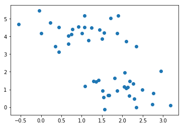
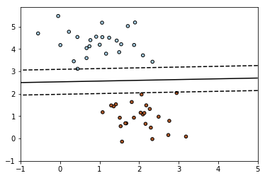

## 廣義線性模型/範例3 : SGD: Maximum margin separating hyperplane

本範例之目的：
* 透過用SGD方法進行訓練的線性分類器：SGDClassifier，在兩種類別的數據集中，繪出每個類別中的最大邊界與超平面使兩種分類被區隔開來
## 一、SGD Classifier
SGD Classifier為一個利用梯度下降法SGD (Stochastic gradient descent)進行訓練的線性分類器(默認為SVM)，模型每次迭代過後會計算樣本loss function梯度，並依據梯度值進行learning rate的更新，learning rate亦會經過迭代次數越多，更新的幅度會越少

## 二、引入函式與模型
* make_blobs為聚類數據生成器

```python
import numpy as np
import matplotlib.pyplot as plt

from sklearn.linear_model import SGDClassifier
from sklearn.datasets import make_blobs
```

## 三、數據產生與模型訓練
* 利用make_blobs產生50個點且分為兩種類別，此語法回傳X為點座標，Y為相對應點的所屬類別

```python
X, Y = make_blobs(n_samples=50, centers=2, random_state=0, cluster_std=0.60)

tempx = []
tempy = []
for i in range(50):
    tempx.append(X[i,0])
    tempy.append(X[i,1])
plt.scatter(tempx,tempy)
```



如上圖所示，make_blobs產生50個點，且分散在左上與右下兩個類別中

* SGDClassifier中的loss function採用hinge使其為線性SVM分類器，alpha為penalty(預設為L2)的參數

```python
clf = SGDClassifier(loss="hinge", alpha=0.01, max_iter=200)
clf.fit(X, Y)
```

## 四、Hyperplane
* clf.decision_function為樣本點到hyperplane的函數距離
* 利用matplotlib中繪製等高線圖的語法contour來繪製hyperplane與最大邊界

```python
# plot the line, the points, and the nearest vectors to the plane
xx = np.linspace(-1, 5, 10)
yy = np.linspace(-1, 5, 10)

X1, X2 = np.meshgrid(xx, yy)
Z = np.empty(X1.shape)
for (i, j), val in np.ndenumerate(X1):
    x1 = val  
    x2 = X2[i, j]  
    p = clf.decision_function([[x1, x2]])
    Z[i, j] = p[0]
print(Z)
levels = [-1.0, 0.0, 1.0]
linestyles = ['dashed', 'solid', 'dashed']
colors = 'k'
plt.contour(X1, X2, Z, levels, colors=colors, linestyles=linestyles)
plt.scatter(X[:, 0], X[:, 1], c=Y, cmap=plt.cm.Paired,
            edgecolor='black', s=20)

plt.axis('tight')
plt.show()
```



上圖的實線即為hyperplane，虛線為以每個類別中樣本點距離hyperplane最近的點，平行於hyperplane的線，即為最大邊界

## 五、原始碼列表
Python source code: plot_sgd_separating_hyperplane.py

https://scikit-learn.org/stable/auto_examples/linear_model/plot_sgd_separating_hyperplane.html

```python
print(__doc__)

import numpy as np
import matplotlib.pyplot as plt
from sklearn.linear_model import SGDClassifier
from sklearn.datasets import make_blobs

# we create 50 separable points
X, Y = make_blobs(n_samples=50, centers=2, random_state=0, cluster_std=0.60)

# fit the model
clf = SGDClassifier(loss="hinge", alpha=0.01, max_iter=200)

clf.fit(X, Y)

# plot the line, the points, and the nearest vectors to the plane
xx = np.linspace(-1, 5, 10)
yy = np.linspace(-1, 5, 10)

X1, X2 = np.meshgrid(xx, yy)
Z = np.empty(X1.shape)
for (i, j), val in np.ndenumerate(X1):
    x1 = val
    x2 = X2[i, j]
    p = clf.decision_function([[x1, x2]])
    Z[i, j] = p[0]
levels = [-1.0, 0.0, 1.0]
linestyles = ['dashed', 'solid', 'dashed']
colors = 'k'
plt.contour(X1, X2, Z, levels, colors=colors, linestyles=linestyles)
plt.scatter(X[:, 0], X[:, 1], c=Y, cmap=plt.cm.Paired,
            edgecolor='black', s=20)

plt.axis('tight')
plt.show()
```
