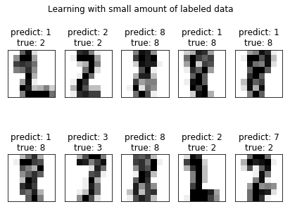

## 半監督式分類法/範例3 : Label Propagation digits: Demonstrating performance

本範例目的：
* 利用少量標籤的手寫數字資料集進行模型訓練，展現半監督式學習的能力

## 一、半監督式學習
在實際的應用上，大部分的資料沒有標籤且數量會遠多於有標籤的資料，而將這些沒有標籤的資料一一標籤是非常耗時的，相對而言，蒐集無標籤的資料更容易，因此可以利用半監督式學習(Semi-supervised learning)對少部分的資料進行標籤，透過這些有標籤的資料擷取特徵，然後再對其他資料進行分類。

## 二、引入函式與模型
* stats用來進行統計與分析
* LabelSpreading為半監督式學習的模型
* confusion_matrix為混淆矩陣
* classification_report用於觀察預測和實際數值的差異，包含precision、recall、f1-score及support

```python
import numpy as np
import matplotlib.pyplot as plt

from scipy import stats
from sklearn import datasets
from sklearn.semi_supervised import LabelSpreading
from sklearn.metrics import confusion_matrix, classification_report
```

## 三、建立dataset
* Dataset取自sklearn.datasets.load_digits，內容為0~9的手寫數字，共有1797筆
* 使用其中的340筆進行訓練，其中40筆為labeled，其餘為unlabeled
* 複製一組340筆的target (y_train)作為訓練集，並將第40筆之後的label都設為-1

```python
digits = datasets.load_digits()
rng = np.random.RandomState(2)
indices = np.arange(len(digits.data))
rng.shuffle(indices)

X = digits.data[indices[:340]]
y = digits.target[indices[:340]]
images = digits.images[indices[:340]]

n_total_samples = len(y)
n_labeled_points = 40

indices = np.arange(n_total_samples)

unlabeled_set = indices[n_labeled_points:]

y_train = np.copy(y)
y_train[unlabeled_set] = -1
```

## 四、模型訓練與預測
* 利用訓練過後的模型進行預測，得到predicted_labels，並與true_labels計算混淆矩陣
* 列出classification report
* support為每個標籤出現的次數
* precision(精確度)為true positives/(true positivies + false positivies)
* recall(召回率)為true positivies/(true positivies + false negatives)
* f1值為精確度與召回率的調和均值，為2 x precision x recall/(precision + recall)
* micro avg為所有數據中，正確預測的比率
* macro avg為每個評估項目未加權的平均值
* weighted avg為每個評估項目加權平均值

```python
lp_model = LabelSpreading(gamma=.25, max_iter=20)
lp_model.fit(X, y_train)
predicted_labels = lp_model.transduction_[unlabeled_set]
true_labels = y[unlabeled_set]

cm = confusion_matrix(true_labels, predicted_labels, labels=lp_model.classes_)

print("Label Spreading model: %d labeled & %d unlabeled points (%d total)" %
      (n_labeled_points, n_total_samples - n_labeled_points, n_total_samples))

print(classification_report(true_labels, predicted_labels))

print("Confusion matrix")
print(cm)
```
Out: 
    
    Label Spreading model: 40 labeled & 300 unlabeled points (340 total)
                    precision    recall  f1-score   support

                 0       1.00      1.00      1.00        27
                 1       0.82      1.00      0.90        37
                 2       1.00      0.86      0.92        28
                 3       1.00      0.80      0.89        35
                 4       0.92      1.00      0.96        24
                 5       0.74      0.94      0.83        34
                 6       0.89      0.96      0.92        25
                 7       0.94      0.89      0.91        35
                 8       1.00      0.68      0.81        31
                 9       0.81      0.88      0.84        24

         micro avg       0.90      0.90      0.90       300
         macro avg       0.91      0.90      0.90       300
      weighted avg       0.91      0.90      0.90       300

      Confusion matrix
      [[27  0  0  0  0  0  0  0  0  0]
       [ 0 37  0  0  0  0  0  0  0  0]
       [ 0  1 24  0  0  0  2  1  0  0]
       [ 0  0  0 28  0  5  0  1  0  1]
       [ 0  0  0  0 24  0  0  0  0  0]
       [ 0  0  0  0  0 32  0  0  0  2]
       [ 0  0  0  0  0  1 24  0  0  0]
       [ 0  0  0  0  1  3  0 31  0  0]
       [ 0  7  0  0  0  0  1  0 21  2]
       [ 0  0  0  0  1  2  0  0  0 21]]

## 五、結果觀察與分析
* 利用stats進行數據的統計，並找出前10筆預測結果最不佳的結果

```python
# Calculate uncertainty values for each transduced distribution
pred_entropies = stats.distributions.entropy(lp_model.label_distributions_.T)

# Pick the top 10 most uncertain labels
uncertainty_index = np.argsort(pred_entropies)[-10:]

# Plot
f = plt.figure(figsize=(7, 5))
for index, image_index in enumerate(uncertainty_index):
    image = images[image_index]

    sub = f.add_subplot(2, 5, index + 1)
    sub.imshow(image, cmap=plt.cm.gray_r)
    plt.xticks([])
    plt.yticks([])
    sub.set_title('predict: %i\ntrue: %i' % (
        lp_model.transduction_[image_index], y[image_index]))

f.suptitle('Learning with small amount of labeled data')
plt.show()
```




## 六、原始碼列表
Python source code: plot_label_propagation_digits.py

https://scikit-learn.org/stable/auto_examples/semi_supervised/plot_label_propagation_digits.html

```python
print(__doc__)

# Authors: Clay Woolam <clay@woolam.org>
# License: BSD

import numpy as np
import matplotlib.pyplot as plt

from scipy import stats

from sklearn import datasets
from sklearn.semi_supervised import LabelSpreading

from sklearn.metrics import confusion_matrix, classification_report

digits = datasets.load_digits()
rng = np.random.RandomState(2)
indices = np.arange(len(digits.data))
rng.shuffle(indices)

X = digits.data[indices[:340]]
y = digits.target[indices[:340]]
images = digits.images[indices[:340]]

n_total_samples = len(y)
n_labeled_points = 40

indices = np.arange(n_total_samples)

unlabeled_set = indices[n_labeled_points:]

# #############################################################################
# Shuffle everything around
y_train = np.copy(y)
y_train[unlabeled_set] = -1

# #############################################################################
# Learn with LabelSpreading
lp_model = LabelSpreading(gamma=.25, max_iter=20)
lp_model.fit(X, y_train)
predicted_labels = lp_model.transduction_[unlabeled_set]
true_labels = y[unlabeled_set]

cm = confusion_matrix(true_labels, predicted_labels, labels=lp_model.classes_)

print("Label Spreading model: %d labeled & %d unlabeled points (%d total)" %
      (n_labeled_points, n_total_samples - n_labeled_points, n_total_samples))

print(classification_report(true_labels, predicted_labels))

print("Confusion matrix")
print(cm)

# #############################################################################
# Calculate uncertainty values for each transduced distribution
pred_entropies = stats.distributions.entropy(lp_model.label_distributions_.T)

# #############################################################################
# Pick the top 10 most uncertain labels
uncertainty_index = np.argsort(pred_entropies)[-10:]

# #############################################################################
# Plot
f = plt.figure(figsize=(7, 5))
for index, image_index in enumerate(uncertainty_index):
    image = images[image_index]

    sub = f.add_subplot(2, 5, index + 1)
    sub.imshow(image, cmap=plt.cm.gray_r)
    plt.xticks([])
    plt.yticks([])
    sub.set_title('predict: %i\ntrue: %i' % (
        lp_model.transduction_[image_index], y[image_index]))

f.suptitle('Learning with small amount of labeled data')
plt.show()
```
